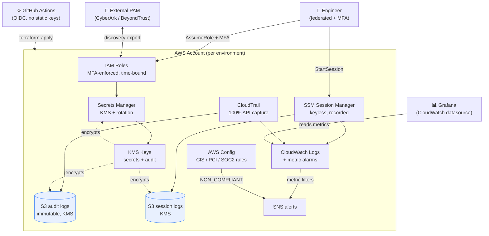
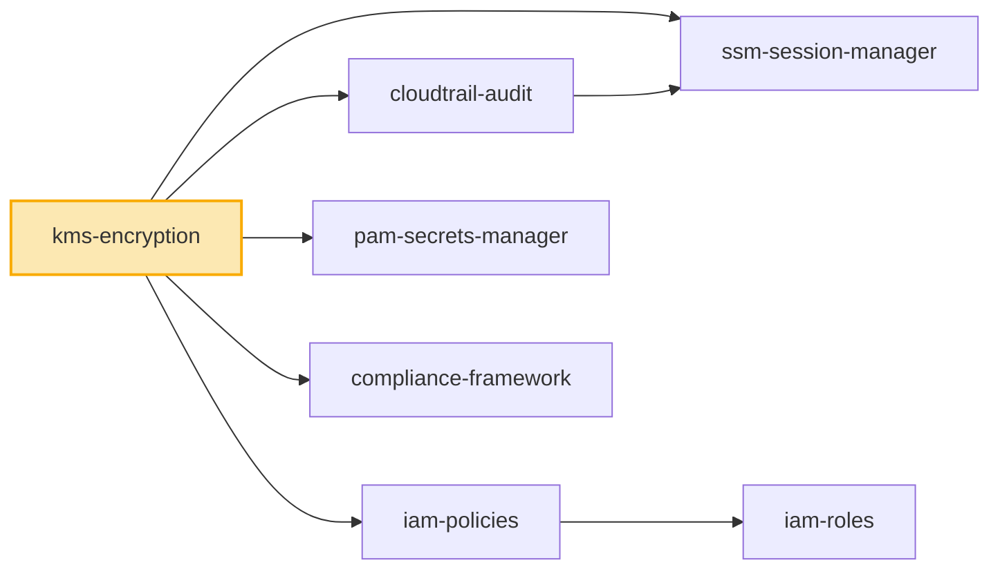
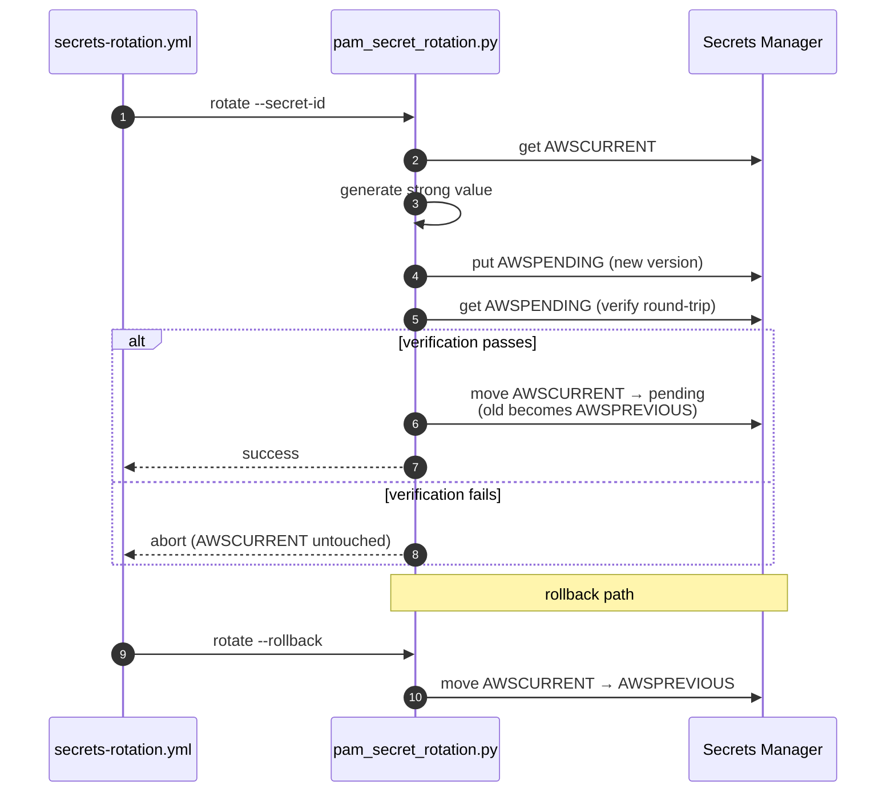
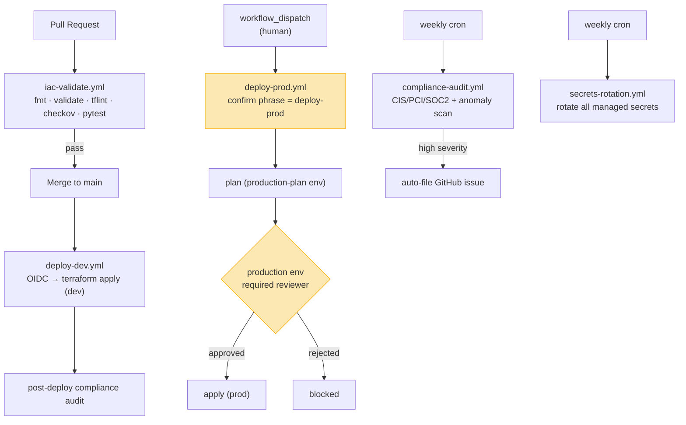

# Architecture Diagrams

All diagrams use [Mermaid](https://mermaid.js.org/), which GitHub renders
natively — no external tooling needed. Edit the fenced ` ```mermaid ` blocks
directly and the rendered picture updates on push.

> **How to read this page:** start with the *System context* for the big
> picture, then the *Module dependency graph* to see how the Terraform fits
> together, then the *sequence diagrams* for the two flows people ask about
> most (getting access, rotating a secret), and finally the *CI/CD* flow for
> how changes ship.

---

## 1. System context (who talks to what)

**Use this** to understand the moving parts and trust boundaries at a glance.



---

## 2. Module dependency graph (Terraform)

**Use this** before editing modules — it shows what feeds what. `kms-encryption`
is the root dependency; break it and everything downstream fails.



Each environment in `terraform/environments/{dev,stage,prod}/main.tf` is an
identical composition of these seven modules — only the variable *values*
differ (rotation cadence, retention, trusted accounts).

---

## 3. Access provisioning flow (request → approval → expiry)

**Use this** when working on `pam_access_provisioner.py`. Note the
separation-of-duties rule: the approver must differ from the requester.

```mermaid
sequenceDiagram
    autonumber
    participant U as Engineer
    participant CLI as pam_access_provisioner.py
    participant DDB as DynamoDB<br/>(pam-access-requests)
    participant A as Approver
    participant IAM as AWS IAM

    U->>CLI: request --user --role --hours --reason
    CLI->>DDB: put_item(status="pending")
    Note over CLI,DDB: justification required;<br/>duration capped at 12h

    A->>CLI: approve --request-id --approver
    CLI->>DDB: get_item
    CLI-->>A: reject if self-approval
    CLI->>IAM: add_user_to_group(role)
    CLI->>DDB: status="active", expires_at=now+hours

    Note over CLI,IAM: ...time passes...

    CLI->>CLI: expire-sweep (scheduled)
    CLI->>IAM: remove_user_from_group
    CLI->>DDB: status="expired"
```

---

## 4. Secret rotation flow (with rollback)

**Use this** when working on `pam_secret_rotation.py`. It implements the
four-step Secrets Manager rotation contract and always keeps the prior value
recoverable.



---

## 5. CI/CD pipeline (how a change ships)

**Use this** to understand what runs when. Dev is automatic on merge; prod is
manual, confirmation-gated, and approval-gated.



---

## Regenerating / exporting

- **GitHub** renders these inline automatically.
- **VS Code**: install the *Markdown Preview Mermaid Support* extension.
- **PNG/SVG export**: `npx @mermaid-js/mermaid-cli -i documentation/DIAGRAMS.md -o out.png`
